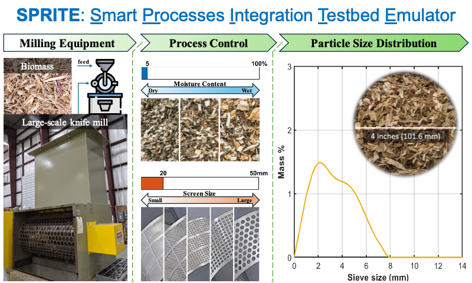

	 ____    ____    ____    ___   _____   _____
	/ ___|  |  _ \  |  _ \  |_ _| |_   _| | ____|
	\___ \  | |_) | | |_) |  | |    | |   |  _|
	 ___) | |  __/  |  _ <   | |    | |   | |___
	|____/  |_|     |_| \_\ |___|   |_|   |_____|
	
	Smart Preprocessing & Robust Integration Emulator

&copy; 2023, Battelle Energy Alliance, LLC  ALL RIGHTS RESERVED

**SPRITE (Smart Preprocessing & Robust Integration Emulator)** is an open-source suite of analytical and data-driven models for predicting the performance of renewable carbon feedstock preprocessing units and system integration. The models being developed in this suite include **Population Balance Model (PBM)**, **Enhanced Deep Neural Operator (DNO+)**, and **Physics-Informed DNO+ (PIDNO+)**.

# About SPRITE

To achieve the desired material properties of granular biomass such as particle size distribution (PSD), the feed material must undergo a milling process during preprocessing. The PSD of biomass plays a critical role in subsequent biofuel manufacturing. It is imperative to accurately predict the PSD of the biomass in the design of preprocessing systems. The population balance model (PBM), upon empirical calibration and validation, can provide rapid prediction of post-milling PSD of granular biomass. However, the standard PSD does not include moisture content as an input parameter. To overcome these drawbacks, a deep learning model called the enhanced deep neural operator (DNO+) is implemented in the code. This model not only retains the capabilities of the PBM in handling complex mapping functions but also incorporates additional factors influencing the system. By considering various experimental conditions such as feed moisture content and discharge screen size, the trained DNO+ model can effectively predict the PSD after milling. The use of this code that contains these models will assist in guiding the milling parameter selection to achieve the desired biomass PSD. 

# Installing SPRITE

Detailed instructions for installing the prerequisite software packages and SPRITE on the different operating systems, e.g., Windows, macOS and Linux Ubuntu LTS releases, are provided. Click the link(s) below to learn about the installation process based on your operating systems.

* [Windows](instruction_Windows/)
* [Linux Ubuntu](instruction_Linux_Ubuntu/)
* [macOS](instruction_macOS/)

# Data description

The original experimental data of corn stalk size reduction was obtained from two mills: a Wiley knife mill at the bench scale and a JRS knife mill at the pilot scale. The data contains the cumulative output particle size distributions (PSDs) under different conditions of processing parameters. Find the description [here](PBM/Dataset).

# Running SPRITE

## Windows

Open *Powershell Prompt* from *Anaconda Navigator*. Go to the SPRITE foler by copying and pasting the following text into the command line and click *Enter* key.

	cd c:/Users/username/Downloads/SPRITE

Run SPRITE.

	python main.py

## Linux

Open a Terminal session. Go to the SPRITE folder.

	cd /home/username/Downloads/SPRITE

Run SPRITE.

	./RUN

## macOS

Open a Terminal session. Go to the SPRITE folder.

	cd /Users/username/Downloads/SPRITE

Run SPRITE.

	./RUN
			

Three models can be used to predict the milled biomass PSD with the given feed biomass PSD under certain milling condition.

* PBM: A probabilistic based model, by data fitting and regression to find the input output relationship. It has mode 1 to show the data fitting performance, and has mode 2 for prediction. In prediction mode, you can use the model to predict exist data from the experiment, or make a new data for it to predict.
* DNO+: A data driven based model, trained by 300 datasets, 100 test datasets. You can try the training process, or use the pre-trained model to make prediction. In prediction mode, you can use the model to predict exist data from the experiment, or make a new data for it to predict.
* PIDNO+: A phyisics-informed and data driven based model, trained by 25 datasets, 5 datasets for testing. You can try the training process, or use the pre-trained model to make prediction.

# Test model on new data

### Create new data

First prepare the feed biomass particle PSD as the input data and the milled product biomass PSD as the output data. The data should include the sieve sizes and the cumulative PSD, in the form of .csv file below.

Example user-provided input file: [/PBM/Dataset/extra_input.csv](/PBM/Dataset/extra_input.csv)

Example reference output file: [/PBM/Dataset/extra_output.csv](/PBM/Dataset/extra_output.csv)

You can directly put your data into these two *csv* files, under the column name: *'FSieves'* and *'Feedmass'* in the input data file, and *'ExpSieves'* and *'Expmass'* in the output data file.

An example procedure is below.

* Run SPRITE, and select Method 1 (PBM)
* When it shows: 'Enter the No. data you want choose (choose between 1~10) or enter 0 for your own data.', press 0.
* Then follow the instruction in the command line prompt.
	* Enter the milling frequency in Hz:
	* Enter the moisture content in %:
* Select the optimization method.
* Finish fitting process and get the results.

# Troubleshooting

* "PermissionError: [Errno 1] Operation not permitted"
	* Conditions: On Mac OS, try to use the model load with DNO+ or PIDNO+ methods under terminal or other python interface.
	* Solver: Open Mac system settings -- Privacy & Security -- Full Disk Access.
		* If your app is in the list: give the disk access to it directly.
		* If your app is not in the list: click on '+' button below, find your app, then give the disk access.
