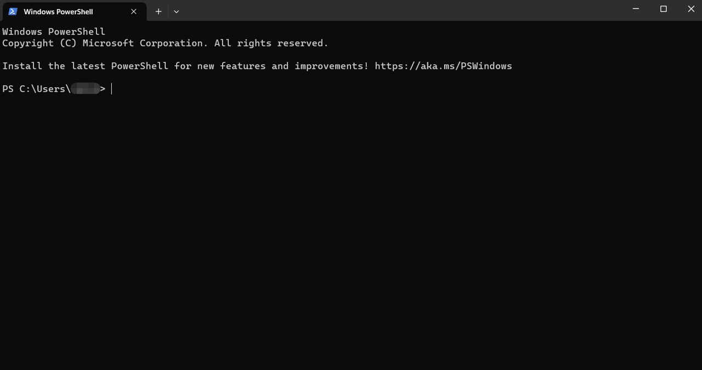

	 ____    ____    ____    ___   _____   _____
	/ ___|  |  _ \  |  _ \  |_ _| |_   _| | ____|
	\___ \  | |_) | | |_) |  | |    | |   |  _|
	 ___) | |  __/  |  _ <   | |    | |   | |___
	|____/  |_|     |_| \_\ |___|   |_|   |_____|
	
	Smart Preprocessing & Robust Integration Emulator

# Setting up SPRITE on Windows

Detailed instructions for setting up SPRITE on Windows are provided as follows.

Tested releases:

* **Windows 11**
* **Windows 10**

Important notes:

 * If you are a **code developer** and plan to make changes of the code and push the changes back to the repository on GitHub, we assume you have a GitHub account and you know how to set up SSH keys on your operating system and add your SSH keys to your GitHub account.
 * We have prepared training data that can be directly used for some data-driven models in SPRITE. It is not mandatory to have the existing training data for using the data-driven models in SPRITE. But generating high-quality training data which are large in file size would take a few hours. We encourage users to download our prepared training data  to get familiar with using the data-driven models in SPRITE. The training data are stored in a separate GitHub repository called **SPRITE-Data**.

Follow the instructions below. In the example commend line instructions below, We use `username` to denote your user name on your operating system. Replace `username` with your user name.

### Installing the prerequisites

#### Install Git

Install Git from the git [website](https://gitforwindows.org/).

Click on Download button.
Install the Git using default options.

Obtain the SPRITE repository:

Click Git Bash icon from the desktop.
Within the Git terminal, navigate to a preferred directory, e.g., the `Downloads` folder:

	cd c:/Users/username/Downloads

#### Downloading the SPRITE repository from GitHub:
<!-- 
Choose one of the download options below:
-->	

Download by git clone.

	git clone https://github.com/yidongxiainl/SPRITE.git
		
<!-- 
* Download option **1b**. Unzip the downloaded file. 

		wget https://github.com/yidongxiainl/SPRITE/archive/refs/heads/main.zip
	
* Download option **2** (recommended for developers):

		git clone git@github.com:yidongxiainl/SPRITE.git
-->	

Note: We have prepared training data that can be directly used for some data-driven models in SPRITE. It is not mandatory to have the existing training data for using the data-driven models in SPRITE. But generating high-quality training data which are large in file size would take a few hours. We encourage users to download our prepared training data  to get familiar with using the data-driven models in SPRITE. The training data are stored in a separate GitHub repository called **SPRITE-Data**. To obtain the repository:

<!-- 
* Navigate to the same directory where the SPRITE repository is located, e.g., the `Downloads` folder:

		cd c:/Users/username/Downloads
-->	
<!-- 
Choose one of the download option below:
-->
Download by git clone.

	git clone https://github.com/yidongxiainl/SPRITE-Data.git
		
<!--
* Download option 1b. Unzip the downloaded file. 

		wget https://github.com/yidongxiainl/SPRITE-Data/archive/refs/heads/main.zip

* Download option 2 (recommended for developers):

		git clone git@github.com:yidongxiainl/SPRITE-Data.git
-->
You can choose to close the Git Bash now.

#### Install Anaconda

Install **Anaconda**. Anaconda Navigator is a desktop graphical user interface (GUI) included in Anaconda® Distribution that allows you to launch applications and manage conda packages, environments, and channels without using command line interface (CLI) commands. Navigator can search for packages on Anaconda.org or in a local Anaconda Repository. To install Anaconda, download it from [the link](https://www.anaconda.com/download/), and follow the instruction on the Anaconda [website](https://docs.anaconda.com/free/anaconda/install/windows/).

Open PowerShell (searching it from the Start). It shows as follows.

		
Follow the command line instructions below.

### Activating the custom Conda environment for SPRITE:
		
Create a new environment named sprite

	conda create -n sprite python=3.9
		
When it shows procceed ([y]/n), press y

To activate the sprite environment, type

	conda activate sprite
		
You can also verify the activation of the SPRITE environment by typing

	conda env list
		
You should see the following command line output.

	# conda environments:
	#
	base                     /Users/username/anaconda
	sprite                *  /Users/username/anaconda/envs/SPRITE

Navigate to the SPRITE repository folder:

	cd c:/Users/username/Downloads/SPRITE

To install the required packages of the sprite environment for SPRITE, type

	pip install -r requirements.txt

Now go back to [**How to use**](../) section.
